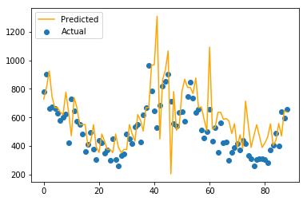

# store-sales-forecast

A data science assignment I did in 2017.

## Quickstart

```
conda create -n sales_forecast python=3.9  
conda activate sales_forecast
pip install -r requirements.txt
jupyter lab Short\ Term\ GBR.ipynb 
```

Get the data from https://www.kaggle.com/c/walmart-recruiting-store-sales-forecasting/data and move `./data`.

## Goal

A retailer has approached us because he is unable to get a grip on the sales forecasting of the stores. He believes he has good data quality but he does not know how to leverage this data in order to create a better forecast. He would like both short and long term forecasts.

## Data

The following information has been provided by the retailer: 

- store_info.csv
    - Information on the type and size of the various stores
- historic_sales.csv
    - Store - the store number
    - Dept - the department number
    - Date - the week
    - Weekly_Sales -  sales for the given department in the given store
    - IsHoliday - whether the week is a special holiday week
- features.csv
    - Store - the store number
    - Date - the week
    - Temperature - average temperature in the region
    - Fuel_Price - cost of fuel in the region
    - MarkDown1-5 - anonymized data related to promotional markdowns
    - CPI - the consumer price index
    - Unemployment - the unemployment rate
    - IsHoliday - whether the week is a special holiday week


## Data insights

### Correlation matrix

The first insight is a correlation matrix.


One can see that the weekly sales are positively correlated with the
anonymized data related to promotions and the type of the week being a
holiday week. The size of the store has a noticeable positive impact on
the sales. The CPI and the unemployment are weakly negatively correlated
with the weekly sales. The temperature and the fuel price are not
correlated with the weekly sales.

### Distribution of weekly sales

The data sets regroup the weekly sales of different stores from
different departments. It is thus filled with a collection of time
series, the following figure presents their statistical features.

|     | mean          | std          | skew        | kurtosis    |
|-------|---------------|--------------|-------------|-------------|
| count | 3323.000000   | 3283.000000  | 3323.000000 | 3323.000000 |
| mean  | 14218.781251  | 3580.283212  | 1.552763    | 5.652568    |
| std   | 20937.641285  | 5734.016494  | 1.488211    | 9.490734    |
| min   | 0.017778      | 0.000000     | -2.403163   | -3.000000   |
| 25\%  | 1027.675174   | 501.720380   | 0.449821    | 0.045974    |
| 50\%  | 6318.644056   | 1670.286108  | 1.173305    | 1.861484    |
| 75\%  | 18439.250112  | 4215.472400  | 2.311495    | 7.089246    |
| max   | 182868.039085 | 74905.807456 | 10.030234   | 109.633096  |


It can be concluded that there are 3323 different weekly sales to
forecast and that they are quite heterogeneous.

### Time series analysis

The following plots represent different weekly sales evolution through
the time, each of them is coming from one department of one store. The
graphs show that some weekly sales are seasonal, some are irregular,
some have a trend and some are missing data.


## Prediction algorithm

The goal of the prediction is to forecast the weekly sales for each
department from each store. As it is a forecasting question, one could
develop an *ARIMA* model for each department. However, this technique
would make no use of the other available feature, such as the
temperature of the week and base the prediction exclusively on
historical weekly sales.

In order to take into account the extra feature and the historical
value, the idea is to add new features to a weekly sales based on its
historical data. For example, adding the sales of last week and the
variance of the sales over the last month.


Then, each weekly sales forecast is related to a store and a department,
those links might have an impact on the forecast, thus they are to be
taken into consideration using dummy values. The same goes for the month
in which the weekly sales are occurring.

Once the features are defined, the model creation takes place. An idea
could be to develop one model for each forecast. However this option
would hide potentials global trends. Hence, a global model will be
trained.

The linear regression model is eliminated as the weights it would create
would be the same for each model although the behaviour of the different
forecasts are not the same.

A model often used to predict time series is k nearest neighbours
(*knn*). It predicts the next value of a time series by looking for a
similar historical pattern within it. The following figure is an example
of its behaviour.


As *knn* is based on Euclidean distance, the features have to be
normalised. As our data sets is composed of several types of data and
each forecast has its own distribution, it is not trivial.

Thus, decision tree based regression are strong candidates and in
particular Gradient Boosting Regressor (*GBR)*. In appendix you will
find a *jupyter notebook* which implements the model and gives
satisfying result for short-term prediction.

Error and accuracy:

- RMSE = 2916.13$
- MAE = 1391.13$
- R^2 = 98\%$

Using leave last out (of each time series) cross-validation technique:

- RMSE = 2237.20$
- MAE = 32.66$

The following figure shows the prediction for two forecasts (the model
has been trained with the predicted values):





There are two possibilities to predict more than a week in advance using
this model. Either, predict one week at the time and recursively include
the prediction in the data set. Or, trying to predict based on older
data. If a model is able to predict the sales of today using only data
from two months ago, then it can predict the sales of the whole next
month using the data from one month ago. The forecast accuracy is
expected to be negatively correlated with its length.

## Application

If the retailer is in possession of an accurate predictor, it would give
him two main advantages. The first one is to have a forecast to adjust
its staff and stock requirements. The second one is to have insight on
how to increase his sales. By analysing the model, it is possible to
detect how to influence the sales. For example, does the sales of the
*store A* is positively linked to the one of *store B*? If so, why and
how to leverage the correlation to increase the overall sales? It will
also give a strong tool to assess the efficiency of promotions. Did the
promotion had an impact on the sales and of what proportion?

## Workload Estimation

After this *PoC*, a few topics are to be considered to estimate the
workload. Firstly, how far does the retailer want to forecast? If it is
a few weeks, then the *GBR* might hold its accuracy. If it is longer,
then another solution would have to be engineered.

If keeping *GBR* is the solution then it has to be modified to forecast
longer, currently it only predicts one step ahead. The current model
should also be improved, mainly though feature selection and
hyper-parameter optimisation. The extension of the forecast length and
its optimisation should take no more than two weeks.

Then, the model has to be implemented at the retailer. To do so, it
required to link the model input with the different retailer's data and
to integrate the forecast in a dashboard. The actual implementation is
very dependent on the retailer infrastructure and is thus hard to
evaluate.

If the retailer wants longer forecast prediction then a new solution has
to be developed. One should look at the availability of more historical
data to give the model more training. The utilisation of deep learning
could help in the prediction but would require more R&D.
